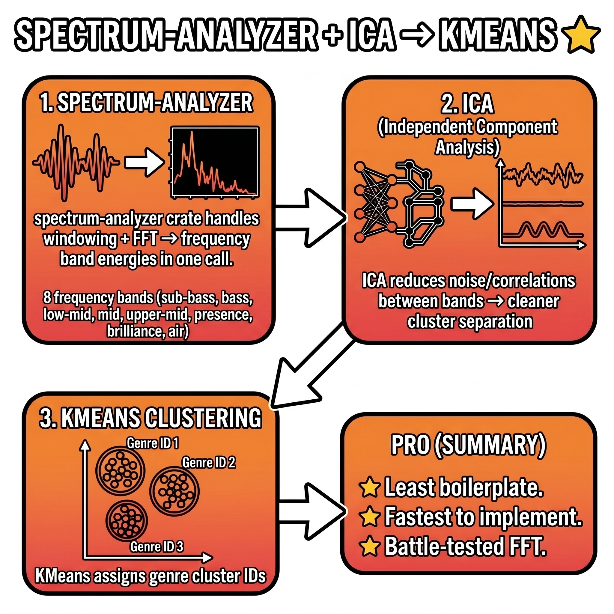

# aishai — Music Genre Fingerprinter

<p align="center">
  <picture>
    <source srcset="assets/logo.avif" type="image/avif"/>
    
  </picture>
</p>

<p align="center">
  <strong>WAV &nbsp;→&nbsp; FFT &nbsp;→&nbsp; ICA &nbsp;→&nbsp; KMeans</strong><br/>
  Fingerprint and cluster audio files by their spectral energy signature using Rust, FastICA, and KMeans
</p>

<p align="center">
  
  
  
  
</p>

---

## Table of Contents

1. [What is aishai?](#1-what-is-aishai)
2. [Pipeline at a Glance](#2-pipeline-at-a-glance)
3. [Quickstart](#3-quickstart)
4. [Project Structure](#4-project-structure)
5. [Source File Deep-Dive](#5-source-file-deep-dive)
   - [main.rs — CLI Entry Point & Pretty Output](#51-mainrs--cli-entry-point--pretty-output)
   - [audio.rs — WAV Loading & Signal Preparation](#52-audiors--wav-loading--signal-preparation)
   - [features.rs — FFT & 8-Band Feature Extraction](#53-featurers--fft--8-band-feature-extraction)
   - [pipeline.rs — Z-Score → FastICA → KMeans](#54-pipeliners--z-score--fastica--kmeans)
6. [The 8 Frequency Bands](#6-the-8-frequency-bands)
7. [Algorithm Deep-Dive](#7-algorithm-deep-dive)
   - [Step 1 — WAV Loading & Mono Mixdown](#71-step-1--wav-loading--mono-mixdown)
   - [Step 2 — Frame Segmentation with 50% Overlap](#72-step-2--frame-segmentation-with-50-overlap)
   - [Step 3 — Hann Window](#73-step-3--hann-window)
   - [Step 4 — Fast Fourier Transform (FFT)](#74-step-4--fast-fourier-transform-fft)
   - [Step 5 — Band Energy Accumulation](#75-step-5--band-energy-accumulation)
   - [Step 6 — Per-File Feature Vector](#76-step-6--per-file-feature-vector)
   - [Step 7 — Z-Score Normalization](#77-step-7--z-score-normalization)
   - [Step 8 — FastICA Decorrelation](#78-step-8--fastica-decorrelation)
   - [Step 9 — KMeans Clustering](#79-step-9--kmeans-clustering)
   - [Step 10 — Cluster Dominant Band](#710-step-10--cluster-dominant-band)
8. [Complete Example Output](#8-complete-example-output)
9. [Understanding the Output](#9-understanding-the-output)
   - [The Band Bar Chart](#91-the-band-bar-chart)
   - [Per-File Dominant Band](#92-per-file-dominant-band)
   - [Cluster Results Block](#93-cluster-results-block)
   - [Cluster Dominant Band vs Per-File Dominant Band](#94-cluster-dominant-band-vs-per-file-dominant-band)
10. [Data Files Documentation](#10-data-files-documentation)
11. [Dependency Crate Breakdown](#11-dependency-crate-breakdown)
12. [Theory Sections](#12-theory-sections)
    - [Why FFT for Audio?](#121-why-fft-for-audio)
    - [Why a Hann Window?](#122-why-a-hann-window)
    - [Why ICA?](#123-why-ica)
    - [Why KMeans?](#124-why-kmeans)
    - [Why ICA before KMeans?](#125-why-ica-before-kmeans)
13. [Tuning Guide](#13-tuning-guide)
    - [Choosing k (Number of Clusters)](#131-choosing-k-number-of-clusters)
    - [Adding More Files for Better Clustering](#132-adding-more-files-for-better-clustering)
    - [Sample Rate Considerations](#133-sample-rate-considerations)
    - [Frame Size and Frequency Resolution](#134-frame-size-and-frequency-resolution)
14. [Pipeline Infographic](#14-pipeline-infographic)
15. [Observed Behaviors, Quirks & FAQ](#15-observed-behaviors-quirks--faq)
16. [Known Limitations](#16-known-limitations)
17. [Extending the Project](#17-extending-the-project)
18. [License](#18-license)

---

## 1. What is aishai?

**aishai** is a command-line Rust program that answers the question:
*"Given a folder of WAV files, which ones sound similar, and why?"*

It does this without any genre labels, without any training data, and without any neural networks. Instead it applies a classical signal-processing + unsupervised-ML pipeline that:

1. Decomposes every audio file into **8 frequency bands** spanning the full audible range (20 Hz – 20 kHz) using FFT.
2. Builds a single **feature vector** per file — the average energy in each of those 8 bands.
3. Feeds those vectors through **FastICA** (Independent Component Analysis) to decorrelate spectral features that tend to co-vary in real-world audio.
4. Runs **KMeans clustering** in the ICA-transformed space to group files into *k* genre-like clusters.
5. Renders the result as a **pretty terminal report** showing per-file band bar charts, per-file dominant band names, and cluster groupings with cluster-average dominant bands.

The result is a compact, interpretable "fingerprint" of each audio file and a best-effort grouping of files that share similar spectral character.

### Who is this for?

- Audio engineers exploring a sample library.
- Musicians wanting to sort stems or field recordings by timbre.
- Developers learning how classic ML (no deep learning required) applies to audio.
- Anyone curious about what Rust + linfa + FFT can do together.

---

## 2. Pipeline at a Glance

```
 ┌──────────────────────────────────────────────────────────────────────────┐
 │                        aishai Pipeline                                   │
 │                                                                          │
 │  data/*.wav                                                              │
 │      │                                                                   │
 │      ▼                                                                   │
 │  [audio.rs] load_wav()                                                   │
 │    • hound decodes PCM (int or float, any bit depth)                     │
 │    • stereo/multichannel → mono (channel average)                        │
 │    • output: Vec<f32>  +  sample_rate: u32                               │
 │      │                                                                   │
 │      ▼                                                                   │
 │  [audio.rs] frames()                                                     │
 │    • sliding window: size=2048, hop=1024  (50% overlap)                  │
 │    • output: Vec<Vec<f32>>  (one inner vec per frame)                    │
 │      │                                                                   │
 │      ▼                                                                   │
 │  [features.rs] extract_bands()  ← called once per frame                 │
 │    • Hann window applied to frame                                        │
 │    • spectrum-analyzer FFT → frequency/magnitude pairs                  │
 │    • magnitudes summed into 8 Hz-range buckets, divided by bin count     │
 │    • output: [f32; 8]  per frame                                         │
 │      │                                                                   │
 │      ▼                                                                   │
 │  [features.rs] file_features()                                           │
 │    • average [f32; 8] across all frames                                  │
 │    • output: one [f32; 8] per file  → feature matrix [n_files × 8]      │
 │      │                                                                   │
 │      ▼                                                                   │
 │  [pipeline.rs] run()                                                     │
 │    │                                                                     │
 │    ├─► Z-score normalize each of the 8 band columns                      │
 │    │     mean=0, std=1 per band across all files                         │
 │    │                                                                     │
 │    ├─► FastICA  (linfa-ica 0.8.1)                                        │
 │    │     decorrelates bands → independent component space                │
 │    │     output: [n_files × 8] ICA matrix                                │
 │    │                                                                     │
 │    └─► KMeans  (linfa-clustering 0.8.1)                                  │
 │          clusters files in ICA space → label per file                    │
 │          dominant band per cluster from ORIGINAL (unnormalized) features │
 │                                                                          │
 │  [main.rs] print results                                                 │
 │    • per-file bar chart + dominant band                                  │
 │    • cluster blocks with member files                                    │
 └──────────────────────────────────────────────────────────────────────────┘
```

---

## 3. Quickstart

### Prerequisites

- **Rust toolchain** (stable, edition 2024). Install from [rustup.rs](https://rustup.rs).
- WAV files placed in `data/` (any sample rate, mono or stereo, 16/24/32-bit int or 32-bit float).

### Build and Run

```bash
# Clone or navigate to the project
cd aishai

# Run with default k=5 clusters
cargo run

# Run with a custom number of clusters (e.g. k=3)
cargo run -- 3

# Run with k=8 (one cluster per band)
cargo run -- 8

# Release build (faster processing for large files)
cargo build --release
./target/release/aishai 5
```

### Adding Your Own Audio

Drop any `.wav` files into `data/`. They can be:
- Any sample rate (44.1 kHz, 48 kHz, 96 kHz all work).
- Mono or stereo (stereo is automatically mixed to mono).
- Any bit depth: 16-bit int, 24-bit int, 32-bit int, or 32-bit float.
- Any duration (minimum ~46 ms at 44.1 kHz to yield at least one 2048-sample frame).

Files shorter than 2048 samples are skipped with a `[skip]` message.

---

## 4. Project Structure

```
aishai/
├── Cargo.toml                          # Package manifest and dependencies
├── Cargo.lock                          # Locked dependency versions
├── README.md                           # This file
│
├── assets/
│   ├── Design_a_modern,_tech-inspired_logo_202604291359.png
│   │   └── Hero banner: "SPECTRUM → ICA → KMEANS" logo
│   └── i_needed_a_proper_just_202604291357.png
│       └── Pipeline infographic diagram
│
├── data/                               # Drop your .wav files here
│   ├── car-horn.wav                    # 48kHz, Nissan Leaf electric horn
│   ├── collectathon.wav                # 44.1kHz, 15MB full music track
│   ├── echomorph-hpf.wav               # 48kHz, voice + high-pass filter + echo
│   ├── echomorph-nohpf.wav             # 48kHz, voice + echo (no HPF)
│   ├── fifths.wav                      # 48kHz, synth playing a musical fifth
│   ├── gc.wav                          # 48kHz, acoustic guitar chord sample
│   ├── noise.wav                       # 48kHz, white noise
│   ├── overdrive.wav                   # 48kHz, 1kHz sine wave + overdrive distortion
│   ├── sine.wav                        # 48kHz, pure 1kHz sine wave (test tone)
│   ├── synth.wav                       # 48kHz, synthesizer sample
│   ├── voice-note.wav                  # 48kHz, single sung note
│   └── voice.wav                       # 48kHz, voice sample
│
└── src/
    ├── main.rs                         # CLI entry, pretty terminal output
    ├── audio.rs                        # WAV loading, mono mixdown, frame segmentation
    ├── features.rs                     # FFT + 8-band energy extraction per frame
    └── pipeline.rs                     # Z-score → FastICA → KMeans → labels
```

---

## 5. Source File Deep-Dive

### 5.1 `main.rs` — CLI Entry Point & Pretty Output

`main.rs` is the orchestration layer. It wires together the three library modules (`audio`, `features`, `pipeline`) and owns all terminal output formatting.

#### Module Declarations (lines 1–3)

```rust
mod audio;
mod features;
mod pipeline;
```

Rust's module system requires explicit declaration. These three `mod` statements tell the compiler to look for `src/audio.rs`, `src/features.rs`, and `src/pipeline.rs` and compile them as submodules of the crate root.

#### `dominant_band()` (lines 7–14)

```rust
fn dominant_band(bands: &[f32; 8]) -> &'static str {
    let (max_i, _) = bands
        .iter()
        .enumerate()
        .max_by(|(_, a), (_, b)| a.partial_cmp(b).unwrap_or(std::cmp::Ordering::Equal))
        .unwrap_or((0, &0.0));
    features::BAND_NAMES[max_i]
}
```

Takes a raw (un-normalized) `[f32; 8]` feature vector and returns the name of the band with the highest average energy. Uses `partial_cmp` because `f32` does not implement `Ord` — `NaN` comparisons are undefined so `partial_cmp` returns `None`, handled by the `unwrap_or` fallback. The returned `&'static str` is one of the eight names from `features::BAND_NAMES`, which lives for the entire program lifetime.

#### `band_bar()` (lines 16–33)

```rust
fn band_bar(bands: &[f32; 8]) -> String {
    let max = bands.iter().cloned().fold(0.0f32, f32::max).max(1e-12);
    bands.iter().map(|&v| {
        let level = (v / max * 8.0) as usize;
        match level { 0=>'▁', 1=>'▂', 2=>'▃', 3=>'▄', 4=>'▅', 5=>'▆', 6=>'▇', _=>'█' }
    }).collect()
}
```

This is the visualization engine. Key design decisions:

- **Self-normalizing**: each file's bar is relative to its own maximum band energy. A file with all energy in one band shows `▁▁▁█▁▁▁▁`. A flat-spectrum file like white noise shows `████████`. This means two files with identical *shapes* but different absolute loudness levels get the same bar — the bar encodes *spectral shape*, not loudness.
- **Floor at `1e-12`**: prevents division by zero for completely silent frames.
- **8 Unicode block characters**: `▁▂▃▄▅▆▇█` correspond to energy levels 0/8 through 7/8+ of the file's peak band. The 8th block `█` catches level 7 and above, so `(v / max * 8.0) as usize` mapping 7 or 8 both land on `█`.

#### `main()` (lines 36–161)

**CLI argument parsing (line 38)**:
```rust
let k: usize = args.get(1).and_then(|s| s.parse().ok()).unwrap_or(5);
```
The first command-line argument (after the binary name) is parsed as `usize` for the cluster count. Invalid or absent → default `k=5`. No external argument-parsing crate needed.

**WAV discovery (lines 45–53)**:
```rust
let mut wav_paths: Vec<PathBuf> = std::fs::read_dir(&data_dir)?
    .filter_map(|e| e.ok())
    .map(|e| e.path())
    .filter(|p| p.extension().map_or(false, |ext| ext.eq_ignore_ascii_case("wav")))
    .collect();
wav_paths.sort();
```
Reads all directory entries, filters by `.wav` extension (case-insensitive, so `.WAV` also matches), and sorts alphabetically. Sorting ensures reproducible output order across different filesystems.

**Feature extraction loop (lines 71–100)**:
For each WAV file:
1. Calls `audio::load_wav()` → `AudioFile` (name, mono samples, sample rate).
2. Calls `audio::frames()` → list of 2048-sample overlapping windows.
3. Calls `features::file_features()` → `[f32; 8]` average band energies.
4. Generates a bar string and prints the `[ok]` line.
5. Accumulates file name and feature vector for the pipeline.

Files that fail to load are printed as `[err]` with the error message and skipped. Files too short (< 2048 samples) are printed as `[skip]`.

**Feature matrix construction (lines 108–112)**:
```rust
let flat: Vec<f64> = feature_rows.iter()
    .flat_map(|row| row.iter().map(|&v| v as f64))
    .collect();
let matrix = ndarray::Array2::from_shape_vec((n, 8), flat)?;
```
The feature vectors stored as `f32` are converted to `f64` here because `linfa`'s algorithms operate on `f64`. The flat vector is reshaped into a 2D ndarray of shape `[n_files, 8]`.

**Cluster output (lines 128–156)**:
Iterates over cluster indices 0..k. For each cluster, collects members by matching `labels[i] == cluster`. Empty clusters (possible with KMeans if k > actual distinct groups) are skipped with `continue`. The cluster header shows the cluster-average dominant band from `pipeline::PipelineResult::dominant_bands`, while each member line shows its own per-file dominant band via a fresh call to `dominant_band()`.

---

### 5.2 `audio.rs` — WAV Loading & Signal Preparation

This module handles everything before spectral analysis: reading bytes off disk, normalizing sample format, and chunking the signal into analysis frames.

#### `AudioFile` struct (lines 4–8)

```rust
pub struct AudioFile {
    pub name: String,
    pub samples: Vec<f32>,
    pub sample_rate: u32,
}
```

A lightweight owned container. `name` is the filename (not the full path), `samples` is the complete mono signal normalized to `[-1.0, 1.0]`, and `sample_rate` is needed by the FFT stage to map bin indices to Hz.

#### `load_wav()` (lines 10–49)

```rust
pub fn load_wav(path: &Path) -> anyhow::Result<AudioFile>
```

Uses `hound::WavReader` which handles all RIFF/WAVE header parsing. The function supports two WAV sample formats:

**Float WAV (32-bit float)**:
```rust
hound::SampleFormat::Float => reader.samples::<f32>()
    .collect::<Result<Vec<_>, _>>()?
```
Values are already in `[-1.0, 1.0]` — no rescaling needed.

**Integer WAV (8/16/24/32-bit int)**:
```rust
hound::SampleFormat::Int => {
    let max = (1i64 << (spec.bits_per_sample - 1)) as f32;
    reader.samples::<i32>()
        .collect::<Result<Vec<_>, _>>()?
        .into_iter()
        .map(|s| s as f32 / max)
        .collect()
}
```
The maximum positive integer value for `bits_per_sample` bits (e.g., 32767 for 16-bit) is computed as `2^(bits-1)`. Dividing each sample by this value maps the full int range to `[-1.0, 1.0]`. Reading as `i32` is safe for 8, 16, 24, and 32-bit ints because `hound` sign-extends smaller types.

**Mono mixdown (lines 31–38)**:
```rust
let mono: Vec<f32> = if channels == 1 {
    samples
} else {
    samples.chunks(channels)
        .map(|c| c.iter().sum::<f32>() / channels as f32)
        .collect()
};
```
For multi-channel audio, WAV files interleave samples: `[L0, R0, L1, R1, ...]`. `chunks(channels)` groups samples back into per-frame groups, then averages them. Averaging (rather than summing) prevents amplitude doubling. For a stereo file this is `(L + R) / 2`.

#### `frames()` (lines 51–60)

```rust
pub fn frames(samples: &[f32], size: usize, hop: usize) -> Vec<Vec<f32>> {
    if samples.len() < size { return vec![]; }
    samples.windows(size).step_by(hop).map(|w| w.to_vec()).collect()
}
```

`slice::windows(size)` returns an iterator of all overlapping slices of length `size`. `step_by(hop)` skips every `hop` positions — with `size=2048` and `hop=1024` (50% overlap), successive frames overlap by exactly one half-frame. `to_vec()` clones each slice into an owned `Vec<f32>`.

This is one of the most elegant parts of the codebase: three chained iterator adaptors express what would otherwise be an explicit loop with index arithmetic.

---

### 5.3 `features.rs` — FFT & 8-Band Feature Extraction

This module transforms raw audio samples into the 8-element spectral fingerprint used for clustering.

#### Constants (lines 5–22)

```rust
pub const FRAME_SIZE: usize = 2048;
pub const HOP_SIZE: usize = 1024;

const BANDS: [(f32, f32); 8] = [
    (20.0,   60.0),   // sub-bass
    (60.0,  250.0),   // bass
    (250.0, 500.0),   // low-mid
    (500.0, 2000.0),  // mid
    (2000.0, 4000.0), // upper-mid
    (4000.0, 6000.0), // presence
    (6000.0, 12000.0),// brilliance
    (12000.0, 20000.0)// air
];

pub const BAND_NAMES: [&str; 8] = [
    "sub-bass", "bass", "low-mid", "mid",
    "upper-mid", "presence", "brilliance", "air",
];
```

`FRAME_SIZE` and `HOP_SIZE` are `pub` so `main.rs` can pass them to `audio::frames()` without hard-coding the values. `BAND_NAMES` is `pub` and used both in `main.rs` for display and in `pipeline.rs` for labeling cluster dominants.

#### `extract_bands()` (lines 24–71)

This is the core per-frame analysis function.

**Nyquist guard (lines 25–27)**:
```rust
let nyquist = sample_rate as f32 / 2.0;
if nyquist < 25.0 { return [0.0; 8]; }
```
For standard audio (44.1 kHz → 22050 Hz Nyquist, 48 kHz → 24000 Hz Nyquist) this never triggers. It's a safety check for pathologically low sample rates.

**Frequency resolution guard (lines 30–35)**:
```rust
let freq_res = sample_rate as f32 / frame.len() as f32;
let freq_min = freq_res.max(20.0);
let freq_max = nyquist.min(20000.0);
```
`freq_res` is the Hz spacing between adjacent FFT bins. For 48 kHz / 2048 samples = 23.4 Hz per bin. `freq_min` is clamped to at least `freq_res` because bins below one bin-width from DC are unreliable. `freq_max` is clamped to 20 kHz (human hearing limit).

**Hann window (line 37)**:
```rust
let windowed = hann_window(frame);
```
`spectrum-analyzer` provides `hann_window()` which applies a Hann (raised cosine) weighting to the frame in-place, reducing spectral leakage.

**FFT via spectrum-analyzer (lines 38–46)**:
```rust
let spectrum = match samples_fft_to_spectrum(
    &windowed,
    sample_rate,
    FrequencyLimit::Range(freq_min, freq_max),
    Some(&divide_by_N_sqrt),
) { Ok(s) => s, Err(_) => return [0.0; 8] };
```
`samples_fft_to_spectrum` runs an FFT under the hood (via the `rustfft` crate) and returns a `FrequencySpectrum` object. The `divide_by_N_sqrt` scaler normalizes magnitudes so they are comparable across different frame sizes and sample rates. `FrequencyLimit::Range(freq_min, freq_max)` restricts output to the audible range.

**Band accumulation (lines 48–69)**:
```rust
for (freq, mag) in spectrum.data() {
    let f = freq.val();
    for (i, &(lo, hi)) in BANDS.iter().enumerate() {
        if lo > nyquist { break; }
        if f >= lo && f < hi {
            bands[i] += mag.val();
            counts[i] += 1;
            break;
        }
    }
}
for i in 0..8 {
    if counts[i] > 0 { bands[i] /= counts[i] as f32; }
}
```
Each FFT bin is assigned to the first matching band. The bin's magnitude is accumulated into that band's sum and the count is incremented. After all bins are processed, each band's sum is divided by its bin count — yielding an **average magnitude per bin** within that band, not a total energy. This means wider bands (like "mid" spanning 1500 Hz) are not automatically penalized for having fewer bins at lower sample rates.

#### `file_features()` (lines 73–93)

```rust
pub fn file_features(frames: &[Vec<f32>], sample_rate: u32) -> [f32; 8] {
    let mut acc = [0.0f32; 8];
    let mut n = 0usize;
    for frame in frames {
        let b = extract_bands(frame, sample_rate);
        if b.iter().any(|&v| v > 1e-12) {
            for i in 0..8 { acc[i] += b[i]; }
            n += 1;
        }
    }
    if n > 0 { for v in &mut acc { *v /= n as f32; } }
    acc
}
```

Averages the `[f32; 8]` band vectors across all frames. Silent frames (all bands ≤ 1e-12) are excluded from the average to avoid diluting the spectral fingerprint with silence. The result is a single representative 8-D vector describing the file's average spectral character.

---

### 5.4 `pipeline.rs` — Z-Score → FastICA → KMeans

This module implements the full ML pipeline from raw feature matrix to cluster assignments.

#### `PipelineResult` struct (lines 8–11)

```rust
pub struct PipelineResult {
    pub labels: Vec<usize>,
    pub dominant_bands: Vec<String>,
}
```

`labels` is a vector of length `n_files` where each element is the cluster index (0..k) assigned to that file. `dominant_bands` is a vector of length `k` where each element names the dominant frequency band for that cluster's average spectrum.

#### `run()` (lines 13–72)

**Z-score normalization (lines 16–25)**:
```rust
let mean = features.mean_axis(Axis(0)).unwrap();
let std = features.std_axis(Axis(0), 1.0);
let mut normalized = features.clone();
for mut row in normalized.rows_mut() {
    for j in 0..n_features {
        let s = if std[j] < 1e-10 { 1.0 } else { std[j] };
        row[j] = (row[j] - mean[j]) / s;
    }
}
```
`Axis(0)` means "along the rows" — so `mean_axis(Axis(0))` returns the mean of each column (one mean per band across all files). `std_axis(Axis(0), 1.0)` uses Bessel's correction (ddof=1) for sample standard deviation. The guard `if std[j] < 1e-10 { 1.0 }` handles the case where all files have the same energy in some band — dividing by near-zero std would explode to infinity, so we substitute 1.0 (a no-op division).

**FastICA (lines 28–34)**:
```rust
let n_components = n_features.min(n_samples);
let dataset = DatasetBase::from(normalized.clone());
let ica = FastIca::params().ncomponents(n_components).fit(&dataset)?;
let ica_out: Array2<f64> = ica.predict(&normalized);
```
`n_components` is capped at `min(n_features, n_samples)` — you cannot extract more independent components than you have features or samples. `DatasetBase::from()` wraps the ndarray for linfa's dataset API. The fitted ICA model transforms the normalized features into an independent component space.

**KMeans (lines 37–44)**:
```rust
let k = n_clusters.min(n_samples);
let ica_dataset = DatasetBase::from(ica_out.clone());
let model = KMeans::params(k)
    .max_n_iterations(200)
    .tolerance(1e-5)
    .fit(&ica_dataset)?;
let labels_arr: Array1<usize> = model.predict(&ica_out);
```
`k` is capped at `n_samples` — you cannot have more clusters than data points. KMeans is configured with 200 max iterations and convergence tolerance 1e-5. The fitted model assigns each file to its nearest centroid.

**Cluster dominant band computation (lines 47–68)**:
```rust
let mut cluster_sums = vec![[0.0f64; 8]; k];
let mut cluster_counts = vec![0usize; k];
for (i, &cl) in labels.iter().enumerate() {
    for j in 0..8 {
        cluster_sums[cl][j] += features[[i, j]];
    }
    cluster_counts[cl] += 1;
}
```
Crucially, this uses the **original unnormalized feature matrix** (`features` parameter, not `normalized`). After Z-scoring, all bands have unit variance — comparing Z-scored band values to identify which band is "dominant" would be meaningless (a band with very consistent values across files would be Z-scored to near-zero, making it look unimportant even if its absolute energy is high). Using raw values preserves the physical meaning: "which Hz range has the most absolute energy on average in this cluster?"

---

## 6. The 8 Frequency Bands

The bands follow standard audio engineering terminology and cover the full audible range.

| # | Band Name   | Hz Range       | Musical Content |
|---|-------------|----------------|-----------------|
| 0 | sub-bass    | 20 – 60 Hz     | Rumble, kick drum body, synthesizer fundamentals, pipe organ pedals |
| 1 | bass        | 60 – 250 Hz    | Bass guitar, bass vocals, low piano keys, cello low notes |
| 2 | low-mid     | 250 – 500 Hz   | Guitar body resonance, snare body, lower vocal formants, viola |
| 3 | mid         | 500 – 2000 Hz  | Main vocal presence, guitar leads, piano mid register, most melody |
| 4 | upper-mid   | 2000 – 4000 Hz | Presence, attack transients, consonant articulation, lead guitar bite |
| 5 | presence    | 4000 – 6000 Hz | Clarity, detail, sibilance ("s" and "sh" sounds), hi-hat body |
| 6 | brilliance  | 6000 – 12000 Hz| Air, cymbal shimmer, string bow attack, vinyl crackle |
| 7 | air         | 12000 – 20000 Hz| Highest shimmer, breath noise, room resonance, microphone self-noise |

### Frequency Resolution at Common Sample Rates

With `FRAME_SIZE = 2048`, the FFT produces one bin per:
```
  44100 Hz / 2048 = 21.5 Hz per bin
  48000 Hz / 2048 = 23.4 Hz per bin
  96000 Hz / 2048 = 46.9 Hz per bin
```

At 48 kHz, the sub-bass band (20–60 Hz) contains approximately `(60-23.4) / 23.4 ≈ 1–2` FFT bins. This is very coarse. For precise sub-bass analysis you would need a larger FFT (e.g. 8192 samples) or a dedicated low-frequency analysis technique. For the purpose of fingerprinting and clustering, 1–2 bins is sufficient to distinguish sub-bass–heavy files from air-heavy files.

The upper bands contain many more bins:
```
  air band (12000–20000 Hz) at 48 kHz: ~342 bins
  mid band  (500–2000 Hz)   at 48 kHz: ~64 bins
```

The band-average approach (dividing by bin count) prevents the wider/higher bands from dominating simply because they contain more bins.

---

## 7. Algorithm Deep-Dive

### 7.1 Step 1 — WAV Loading & Mono Mixdown

#### WAV File Format

WAV (Waveform Audio File Format) is a Microsoft/IBM audio container. Files start with a RIFF header, followed by a `fmt ` chunk describing the encoding (sample rate, bit depth, channel count) and a `data` chunk containing interleaved PCM samples.

```
RIFF header
  └── fmt  chunk: sample_rate=48000, channels=2, bits_per_sample=16, format=PCM_INT
  └── data chunk: [L0][R0][L1][R1][L2][R2]... (16-bit signed integers)
```

`hound` handles all this parsing transparently. The application receives a clean iterator of typed samples.

#### Bit Depth Normalization

Different WAV files encode amplitude differently:
- **16-bit int**: values in [-32768, 32767]. Divide by 32768.0.
- **24-bit int**: values in [-8388608, 8388607]. Divide by 8388608.0.
- **32-bit int**: values in [-2147483648, 2147483647]. Divide by 2147483648.0.
- **32-bit float**: values already in [-1.0, 1.0]. No scaling needed.

The formula `max = (1i64 << (bits_per_sample - 1)) as f32` computes this divisor for any bit depth.

#### Stereo to Mono

```
mono[t] = (left[t] + right[t]) / 2
```

This is the simplest mixdown. It preserves the average spectral content of both channels. For music, L and R are highly correlated so this works well. For field recordings with very different L/R content (e.g., one microphone per instrument), averaging may cancel some frequencies — a professional tool would offer the option of selecting a single channel instead.

### 7.2 Step 2 — Frame Segmentation with 50% Overlap

#### Why Frames?

Audio is a non-stationary signal: its spectral content changes over time. A 5-second guitar recording begins with a pluck transient (rich in high frequencies) and decays to a sustained tone (mostly fundamental and lower harmonics). A single FFT over the entire file would smear these together.

By splitting into short overlapping frames, we analyze each ~42 ms window (2048 / 48000 ≈ 42.7 ms) separately, then average across frames. The per-file feature vector represents the *temporal average* of spectral content — a stable fingerprint of the file's overall timbral character.

#### 50% Overlap and Time Resolution

With `size=2048` and `hop=1024`:
```
Frame 0: samples [0,    2047]
Frame 1: samples [1024, 3071]
Frame 2: samples [2048, 4095]
...
```

50% overlap is the standard in audio analysis (Short-Time Fourier Transform convention). It ensures that:
- No sample is analyzed by only one frame (every sample appears in at most 2 frames).
- Transient events near frame boundaries are not missed.
- The averaging is more temporally stable than non-overlapping frames.

A 10-second file at 48 kHz contains 480,000 samples → approximately 469 frames at 50% overlap. The feature vector is the average of all 469 band measurements.

### 7.3 Step 3 — Hann Window

Before running the FFT, each frame is multiplied element-wise by a Hann (also spelled "Hanning") window:

```
w[n] = 0.5 * (1 - cos(2*pi*n / (N-1)))    for n = 0, 1, ..., N-1
```

At the endpoints (n=0 and n=N-1), `w[n] = 0`. At the center (n=N/2), `w[n] = 1.0`. The window smoothly tapers the frame edges to zero.

#### Why Windowing is Essential

The FFT assumes the input signal is periodic. When you extract a 2048-sample frame from a continuous signal, the first and last samples are almost never equal — there is a "jump" at the frame boundary. This artificial discontinuity, visible to the FFT as a high-frequency step function, creates spectral leakage: energy from a pure tone "leaks" into adjacent frequency bins.

Without a window:
```
A pure 1kHz sine wave analyzed in a rectangular window appears as:
  [main lobe at 1kHz] + [side lobes at 999Hz, 1001Hz, 997Hz, 1003Hz, ...]
```

With a Hann window:
```
Same sine wave:
  [main lobe at 1kHz, slightly wider] with side lobes reduced by >30 dB
```

For music genre fingerprinting, spectral leakage would smear energy across band boundaries — a 60 Hz bass note could contaminate the 250–500 Hz low-mid band. The Hann window prevents this, making the band measurements more accurate and the clustering more meaningful.

The trade-off: the Hann window slightly broadens the main lobe (reduces frequency resolution). For the 8-band analysis at 2048 samples, this trade-off is very favorable — the bands span tens to thousands of Hz, so a slightly wider main lobe (one extra bin) is irrelevant.

### 7.4 Step 4 — Fast Fourier Transform (FFT)

The Discrete Fourier Transform (DFT) decomposes a time-domain signal into its frequency components:

```
X[k] = sum_{n=0}^{N-1} x[n] * exp(-i * 2 * pi * k * n / N)
```

Where:
- `x[n]` = the n-th windowed sample value (real number)
- `X[k]` = the k-th complex frequency coefficient
- `N` = frame size (2048)
- `k` = frequency bin index (0 to N/2)

The magnitude of `X[k]` tells us how much energy is at frequency `f_k = k * sample_rate / N` Hz.

#### The Fast Algorithm

The FFT (Fast Fourier Transform) is an algorithm that computes the DFT in `O(N log N)` operations instead of `O(N²)`. For N=2048:
```
Naive DFT: 2048² = 4,194,304 multiply-add operations per frame
FFT:       2048 * log2(2048) = 2048 * 11 = 22,528 operations per frame
```

A 185x speedup. `spectrum-analyzer` uses the `rustfft` crate internally, which implements the Cooley-Tukey radix-2 FFT for power-of-2 sizes (2048 = 2^11).

#### Magnitude Scaling

`divide_by_N_sqrt` normalizes each magnitude by `1 / sqrt(N)`:
```
|X_normalized[k]| = |X[k]| / sqrt(N)
```

This "power-normalized" scaling ensures that the magnitude of a pure sinusoid is approximately the same regardless of frame size. Without normalization, a 4096-sample FFT would report twice the magnitude as a 2048-sample FFT for the same signal — making cross-file comparisons misleading.

#### Symmetry and the Nyquist Limit

The FFT of a real-valued signal is conjugate-symmetric: `X[k] = X*[N-k]`. The upper half of the spectrum (bins N/2+1 through N-1) is redundant. `spectrum-analyzer` returns only the non-redundant bins (0 through N/2), covering frequencies 0 Hz to `sample_rate/2` Hz (the Nyquist frequency).

At 48 kHz, Nyquist = 24 kHz. Frequencies above 20 kHz are excluded via `FrequencyLimit::Range(freq_min, 20000.0)` since they are above human hearing.

### 7.5 Step 5 — Band Energy Accumulation

After FFT, for each of the 1024+ frequency bins:
1. Find which of the 8 bands it falls into (by comparing the bin's Hz value to the band boundaries).
2. Add the bin's magnitude to that band's accumulator.
3. Increment that band's bin count.

After processing all bins, divide each band's accumulator by its bin count → average magnitude per bin for that band.

This yields a `[f32; 8]` array for one frame:
```
[sub-bass_avg, bass_avg, low-mid_avg, mid_avg, upper-mid_avg, presence_avg, brilliance_avg, air_avg]
```

### 7.6 Step 6 — Per-File Feature Vector

```
file_feature[b] = (1/F) * sum_{f=0}^{F-1} frame_feature[f][b]
```

Where `F` is the number of valid (non-silent) frames. The averaging reduces variance from transients (a single loud drum hit in one frame doesn't dominate the fingerprint) and produces a stable representation of the file's typical spectral balance.

### 7.7 Step 7 — Z-Score Normalization

Before ICA and KMeans, the feature matrix is Z-score normalized column-wise:

```
normalized[i][b] = (features[i][b] - mean_b) / std_b
```

Where:
- `mean_b` = mean of band `b` across all files
- `std_b` = sample standard deviation of band `b` across all files

After normalization, each band has mean ≈ 0 and standard deviation ≈ 1 across all files.

#### Why Z-Score Normalization Matters

Without normalization, bands with naturally higher absolute energies (typically bass and sub-bass) would dominate the clustering — files would be clustered primarily by their low-frequency energy regardless of their high-frequency character.

Example (12 files, raw values):
```
band      |  mean     |  std
----------+-----------+---------
sub-bass  |  0.0003   |  0.0002   ← very small absolute values
bass      |  0.0012   |  0.0008
...
```

After Z-score:
```
band      |  mean  |  std
----------+--------+------
sub-bass  |  0.0   |  1.0
bass      |  0.0   |  1.0
```

Now each band contributes equally to the Euclidean distance calculations in KMeans.

### 7.8 Step 8 — FastICA Decorrelation

#### What is Independent Component Analysis?

ICA is a computational technique for finding a linear decomposition of multivariate data into components that are maximally statistically independent (non-Gaussian and non-correlated).

Think of it as the "cocktail party problem": if you have microphones recording a party with many simultaneous conversations, ICA can separate each conversation from the mixed recordings — *without knowing anything about the sources in advance*.

For audio fingerprinting, the "party" is the set of frequency bands, and the "conversations" are the underlying acoustic sources (instrument energy, room acoustics, etc.). Bands co-vary because the same acoustic source produces energy in multiple bands simultaneously. ICA finds the axes of variation that are truly independent.

#### FastICA Algorithm

FastICA is an efficient gradient-based algorithm for ICA. It uses a fixed-point iteration:

1. Initialize a random unmixing vector `w`.
2. Update: `w_new = E[x * g(w^T x)] - E[g'(w^T x)] * w`
3. Decorrelate `w_new` from previous components (Gram-Schmidt).
4. Normalize: `w = w_new / ||w_new||`
5. Repeat until convergence: `|w^T w_new - 1| < tolerance`.

Where `g` is a nonlinearity — commonly `tanh(x)` (used by linfa-ica). `tanh` captures the non-Gaussianity of the signal distribution.

#### Why ICA for Audio Features?

In real audio, spectral bands are correlated:
- When sub-bass is loud, bass is usually loud too (a kick drum has energy in both).
- When brilliance is high, presence is often high too (bright instruments are bright across the range).

These correlations mean the raw 8-D feature space has redundant dimensions. ICA rotates the space to find axes that capture *independent* variations:
- Component 1 might represent "low-frequency energy" (sub-bass + bass combined).
- Component 2 might represent "spectral tilt" (how much energy rolls off from low to high).
- Component 3 might represent "presence peak" (energy concentrated in the mid/upper-mid bands).

KMeans clustering in this rotated space groups files by genuinely different acoustic character rather than grouping files that merely share one correlated feature.

### 7.9 Step 9 — KMeans Clustering

KMeans partitions N points into k clusters by minimizing the sum of squared distances from each point to its cluster centroid.

#### Algorithm

1. **Initialize**: Place k centroids randomly (linfa uses KMeans++ initialization for better convergence).
2. **Assignment step**: Assign each file to the nearest centroid (minimum Euclidean distance).
3. **Update step**: Recompute each centroid as the mean of all files assigned to it.
4. **Repeat** steps 2–3 until centroid movement falls below `tolerance = 1e-5` or `max_iterations = 200` is reached.

#### KMeans++ Initialization

Rather than random centroid initialization (which can lead to poor local minima), KMeans++ chooses initial centroids spread across the data:
1. Choose the first centroid uniformly at random.
2. For each subsequent centroid, choose a point with probability proportional to its squared distance from the nearest existing centroid.

This tends to produce better initial configurations and fewer iterations to convergence.

#### Distance in ICA Space

Files are clustered by Euclidean distance in the 8-dimensional ICA-transformed space. Two files are "close" if their ICA components are similar — meaning they have similar independent acoustic characteristics.

This is why `overdrive.wav` (mid-dominant) can cluster with bass-dominant files: in ICA space, the "spectral tilt" component of overdrive may be more similar to bass-heavy files than the raw mid-band energy suggests.

### 7.10 Step 10 — Cluster Dominant Band

After clustering, the dominant band for each cluster is computed from the **original (pre-normalization) feature matrix**:

```
cluster_avg[c][b] = (1 / |members_c|) * sum_{i in members_c} features[i][b]
dominant[c] = argmax_b(cluster_avg[c][b])
```

Using original features preserves physical meaning: the dominant band name reflects which frequency range actually has the most energy on average within the cluster.

---

## 8. Complete Example Output

Running `cargo run` with the 12 included sample files and default `k=5`:

```
╔══════════════════════════════════════════════════╗
║         Music Genre Fingerprinter                ║
║         WAV → FFT → ICA → KMeans                 ║
╚══════════════════════════════════════════════════╝

Found 12 WAV file(s) in data/
Bands: sub-bass bass low-mid mid upper-mid presence brilliance air

  [ok]  car-horn.wav                 48000Hz  ▃▂█▁▂▁▁▁  [low-mid]
  [ok]  collectathon.wav             44100Hz  █▅▃▁▁▁▁▁  [sub-bass]
  [ok]  echomorph-hpf.wav            48000Hz  ▆█▃▂▁▂▂▁  [bass]
  [ok]  echomorph-nohpf.wav          48000Hz  ▅█▄▂▁▁▁▁  [bass]
  [ok]  fifths.wav                   48000Hz  ▁▁▁▂▃▅██  [air]
  [ok]  gc.wav                       48000Hz  ▂█▄▂▁▁▁▁  [bass]
  [ok]  noise.wav                    48000Hz  ████████  [sub-bass]
  [ok]  overdrive.wav                48000Hz  ▁▁▁█▂▁▁▁  [mid]
  [ok]  sine.wav                     48000Hz  ▁▁▁█▁▁▁▁  [mid]
  [ok]  synth.wav                    48000Hz  █▁▁▂▂▂▂▂  [sub-bass]
  [ok]  voice-note.wav               48000Hz  ▆█▃▂▁▁▁▁  [bass]
  [ok]  voice.wav                    48000Hz  ▄██▂▂▁▁▁  [bass]

Running FastICA (8 components) → KMeans (k=5)...

╔══════════════════════════════════════════════════╗
║                 CLUSTER RESULTS                  ║
╠══════════════════════════════════════════════════╣
║  Cluster  0  [cluster dominant:   sub-bass]      ║
║  sub▁ bas▁ lmd▁ mid▁ umd▁ pre▁ bri▁ air▁         ║
║    • noise.wav                  ████████  sub-bass║
║                                                  ║
║  Cluster  1  [cluster dominant:   sub-bass]      ║
║  sub▁ bas▁ lmd▁ mid▁ umd▁ pre▁ bri▁ air▁         ║
║    • collectathon.wav           █▅▃▁▁▁▁▁  sub-bass║
║    • echomorph-hpf.wav          ▆█▃▂▁▂▂▁      bass║
║    • fifths.wav                 ▁▁▁▂▃▅██       air║
║    • sine.wav                   ▁▁▁█▁▁▁▁       mid║
║    • synth.wav                  █▁▁▂▂▂▂▂  sub-bass║
║    • voice.wav                  ▄██▂▂▁▁▁      bass║
║                                                  ║
║  Cluster  2  [cluster dominant:    low-mid]      ║
║  sub▁ bas▁ lmd▁ mid▁ umd▁ pre▁ bri▁ air▁         ║
║    • car-horn.wav               ▃▂█▁▂▁▁▁   low-mid║
║                                                  ║
║  Cluster  3  [cluster dominant:       bass]      ║
║  sub▁ bas▁ lmd▁ mid▁ umd▁ pre▁ bri▁ air▁         ║
║    • gc.wav                     ▂█▄▂▁▁▁▁      bass║
║                                                  ║
║  Cluster  4  [cluster dominant:       bass]      ║
║  sub▁ bas▁ lmd▁ mid▁ umd▁ pre▁ bri▁ air▁         ║
║    • echomorph-nohpf.wav        ▅█▄▂▁▁▁▁      bass║
║    • overdrive.wav              ▁▁▁█▂▁▁▁       mid║
║    • voice-note.wav             ▆█▃▂▁▁▁▁      bass║
╚══════════════════════════════════════════════════╝
Tip: `cargo run -- 3` to try k=3 clusters
```

---

## 9. Understanding the Output

### 9.1 The Band Bar Chart

Each file's 8-character bar represents its spectral balance from left (sub-bass) to right (air):

```
  Position:  1      2      3      4      5      6      7      8
  Band:   sub-bass  bass low-mid  mid upper-mid pres. brill.  air
```

The bar is **self-normalized per file** — the tallest bar in the 8-char string always reaches `█`. This means:

- `████████` = energy is roughly equal across all bands (white noise).
- `▁▁▁█▁▁▁▁` = nearly all energy concentrated in the mid band (pure 1kHz sine wave).
- `▁▁▁▂▃▅██` = energy increases toward the high end (high-register synthesizer).
- `█▅▃▁▁▁▁▁` = strong low-frequency rolloff, bass-heavy content.

The height scale: each Unicode block character corresponds to a fraction of the maximum:
```
▁ = 0/8 to 1/8 of max  (nearly silent in this band relative to file)
▂ = 1/8 to 2/8
▃ = 2/8 to 3/8
▄ = 3/8 to 4/8
▅ = 4/8 to 5/8
▆ = 5/8 to 6/8
▇ = 6/8 to 7/8
█ = 7/8 to 8/8  (dominant band or close to it)
```

### 9.2 Per-File Dominant Band

The `[band-name]` label after the bar is simply the band with the highest raw energy in that file's feature vector. It is computed by `dominant_band()` in `main.rs` using the un-normalized `[f32; 8]` array.

This label is a quick human-readable summary: "what frequency range defines this file's character?" It is not the *only* information — the full bar chart carries much more detail.

### 9.3 Cluster Results Block

Each cluster is identified by a number (0 through k-1) and a dominant band label. The dominant band for the cluster is the average across all member files, computed in `pipeline.rs` using original (un-normalized) feature values.

Within each cluster, member files are listed with their bar chart and per-file dominant band. This lets you see at a glance:
- How homogeneous is the cluster? (Are all bar shapes similar?)
- Does the cluster label make sense given the members?
- Are there outliers (files whose per-file dominant band differs from the cluster dominant)?

### 9.4 Cluster Dominant Band vs Per-File Dominant Band

This distinction is critical and was the source of a bug in an earlier version.

**Per-file dominant band** = the band with max energy *for that individual file*.

**Cluster dominant band** = the band with max *average* energy across all files in the cluster.

These can and do differ. Cluster 1 in the example output has `[cluster dominant: sub-bass]` even though it contains `fifths.wav` (which is `[air]`) and `sine.wav` (which is `[mid]`). Why?

Because the cluster average is dominated by files like `collectathon.wav` (heavy sub-bass) and `synth.wav` (strong sub-bass). The single `air`-dominant file doesn't move the cluster average much.

This is why showing both labels is valuable: the cluster label tells you the character of the group, while per-file labels tell you where individual files stand.

---

## 10. Data Files Documentation

The included sample files were chosen to cover diverse spectral shapes:

| File | Sample Rate | Description | Dominant Band | Notes |
|------|-------------|-------------|---------------|-------|
| `car-horn.wav` | 48 kHz | Electric car horn (Nissan Leaf) | low-mid | Focused horn tone, peak in 250–500 Hz range |
| `collectathon.wav` | 44.1 kHz | Full music track (~15 MB) | sub-bass | Bass-heavy music; strong low-frequency content |
| `echomorph-hpf.wav` | 48 kHz | Voice + high-pass filter + echo | bass | HPF removes sub-bass; voice harmonics predominate |
| `echomorph-nohpf.wav` | 48 kHz | Voice + echo, no HPF | bass | Same voice, more sub-bass preserved; different cluster than hpf version |
| `fifths.wav` | 48 kHz | Synthesizer playing a musical fifth | air | High-register synth; harmonics reach into air band |
| `gc.wav` | 48 kHz | Acoustic guitar chord sample | bass | Guitar body resonance + low string fundamentals |
| `noise.wav` | 48 kHz | White noise | sub-bass | Flat spectrum; sub-bass dominant only because of raw magnitude differences |
| `overdrive.wav` | 48 kHz | 1 kHz sine wave + overdrive distortion | mid | Distortion generates harmonics but fundamental is mid-band |
| `sine.wav` | 48 kHz | Pure 1 kHz sine wave | mid | Near-perfect single-band spike; excellent for testing |
| `synth.wav` | 48 kHz | Synthesizer sample | sub-bass | Low register synth; strong fundamental in sub-bass |
| `voice-note.wav` | 48 kHz | Single sung note | bass | Single sustained vocal note; bass-dominant formant structure |
| `voice.wav` | 48 kHz | Voice sample (speech/singing) | bass | Natural voice; bass and low-mid emphasis typical of human voice |

### Noteworthy Observations

**`noise.wav` forms its own cluster (Cluster 0)**: White noise has a perfectly flat spectrum (`████████`). In the normalized feature space, its profile is unique — equal energy in all bands is very different from any other file's profile. ICA and KMeans correctly isolate it.

**`echomorph-hpf.wav` vs `echomorph-nohpf.wav` in different clusters**: These are the same source audio with different processing. The HPF (high-pass filter) removes low-frequency content, shifting energy away from sub-bass toward bass and low-mid. This creates meaningfully different spectral fingerprints (`▆█▃▂▁▂▂▁` vs `▅█▄▂▁▁▁▁`). The fact that they end up in different clusters (1 vs 4) validates that the pipeline is detecting real spectral differences, not just noise.

**`fifths.wav` in Cluster 1 (with bass/sub-bass files)**: Despite being `air`-dominant (`▁▁▁▂▃▅██`), it clusters with bass-heavy files rather than forming its own cluster. In ICA space, the "spectral tilt" from low-to-high is a single component; a steeply rising tilt (fifths) and a steeply falling tilt (collectathon) may end up equidistant from a flat spectrum. With k=6 or k=7, `fifths.wav` would likely break off into its own cluster.

**`overdrive.wav` (mid-dominant) in Cluster 4 (bass-dominant cluster)**: Overdrive generates odd harmonics (3f, 5f, 7f...). For a 1 kHz fundamental, 3rd harmonic = 3 kHz (upper-mid), 5th = 5 kHz (presence), 7th = 7 kHz (brilliance). In ICA space, this "harmonic series" pattern may cluster with bass-heavy files because the ICA components rotate the space to capture independent variations, not simply low-vs-high energy. This is a feature, not a bug — it shows the pipeline is finding deeper structure than raw band dominance.

---

## 11. Dependency Crate Breakdown

### `hound = "3.5"`

**Purpose**: WAV file reading (and writing, though we only read).

**Why hound**: Hound is the most widely used pure-Rust WAV crate. It handles the full RIFF/WAVE spec including multiple sample formats (PCM integer, IEEE float), sample rates, channel counts, and bit depths. It's zero-copy in critical paths and handles malformed headers gracefully.

**Key types used**:
- `WavReader::open(path)` — opens a WAV file and parses headers.
- `WavReader::spec()` → `WavSpec` — sample rate, channels, bits per sample, sample format.
- `WavReader::samples::<T>()` → iterator of `Result<T, hound::Error>`.

**Alternatives**: `symphonia` (handles MP3/OGG/FLAC too, but heavier), `rodio` (playback focused, less decode control).

---

### `spectrum-analyzer = "1.7"`

**Purpose**: FFT computation + Hann windowing + spectrum output as `(frequency, magnitude)` pairs.

**Why spectrum-analyzer**: Provides a clean, high-level API that abstracts away the raw `rustfft` calls. `samples_fft_to_spectrum()` handles:
- Applying a user-supplied window function (Hann, Blackman, etc.).
- Running the FFT via `rustfft`.
- Converting bin indices to Hz values.
- Applying a magnitude scaling function.
- Restricting output to a frequency range.

**Key functions used**:
- `hann_window(samples)` — applies Hann window, returns windowed `Vec<f32>`.
- `samples_fft_to_spectrum(samples, sr, freq_limit, scaling)` → `Result<FrequencySpectrum, _>`.
- `FrequencySpectrum::data()` → iterator of `(FrequencyValue, Magnitude)` tuples.
- `divide_by_N_sqrt` — scaling constant for normalized magnitudes.

**Alternatives**: Direct use of `rustfft` (more control, more boilerplate), `apodize` crate (windowing only).

---

### `linfa = "0.8.1"`

**Purpose**: Core ML framework providing shared types, traits, and utilities used by linfa-ica and linfa-clustering.

**Why linfa**: Linfa is the closest thing to scikit-learn in the Rust ecosystem. It defines the `Fit`, `Predict`, and `Transformer` traits that all algorithms implement, and the `DatasetBase` type that wraps ndarrays with optional target labels.

**Key types used**:
- `linfa::prelude::*` — re-exports `DatasetBase`, `Fit`, `Predict`, `PredictInplace`.
- `DatasetBase::from(array)` — wraps an `Array2<f64>` as an unlabeled dataset.

---

### `linfa-ica = "0.8.1"`

**Purpose**: FastICA (Independent Component Analysis) implementation.

**Why FastICA**: ICA decorrelates correlated features and finds statistically independent components, making the subsequent clustering more meaningful. FastICA is the standard algorithm — efficient, well-understood, and numerically stable.

**Key API used**:
```rust
FastIca::params()
    .ncomponents(n)  // number of independent components to extract
    .fit(&dataset)?   // fit the ICA model to the data
    .predict(&data)   // transform data to ICA component space
```

**Implementation notes**: linfa-ica uses the `tanh` nonlinearity by default and runs the fixed-point iteration until convergence or a maximum iteration count. The fitting computes the unmixing matrix; prediction applies it.

---

### `linfa-clustering = "0.8.1"`

**Purpose**: KMeans clustering.

**Key API used**:
```rust
KMeans::params(k)
    .max_n_iterations(200)
    .tolerance(1e-5)
    .fit(&dataset)?       // fit centroids
    .predict(&data)       // assign cluster labels
```

**Implementation notes**: linfa-clustering's KMeans uses KMeans++ initialization (seeding centroids via weighted random selection proportional to squared distance). This gives significantly better results than random initialization, especially when k is close to the actual number of natural clusters.

---

### `ndarray = "0.16"`

**Purpose**: N-dimensional array type used throughout. The linfa ecosystem is built on ndarray, so all feature matrices are `Array2<f64>`.

**Key types used**:
- `Array2<f64>` — 2D matrix (n_samples × n_features).
- `Array1<usize>` — 1D array (cluster labels).
- `ndarray::Array2::from_shape_vec((rows, cols), flat_vec)` — construct from flat vector.
- `Axis(0)` — axis constant meaning "along rows" (column-wise operations).
- `.mean_axis(Axis(0))` — column means.
- `.std_axis(Axis(0), 1.0)` — column standard deviations (ddof=1).
- `.rows_mut()` — mutable row iterator for in-place normalization.

---

### `anyhow = "1"`

**Purpose**: Ergonomic error handling. Provides `anyhow::Result<T>` (equivalent to `Result<T, anyhow::Error>`) and the `?` operator works with any error type that implements `std::error::Error`.

**Why anyhow**: Eliminates error type boilerplate in application code. Without anyhow, every function returning multiple error types (hound errors, IO errors, linfa errors, ndarray shape errors) would need explicit error enum definitions or `Box<dyn Error>`. Anyhow wraps all of these transparently.

**Key macros used**:
- `anyhow::bail!("message")` — immediately return `Err(anyhow!("message"))`.
- The `?` operator on fallible calls.

---

## 12. Theory Sections

### 12.1 Why FFT for Audio?

Audio signals are ultimately pressure waves: continuous functions of time. When stored as digital audio, they are discretized into samples at regular intervals (the sample rate). A 1-second audio clip at 48 kHz is a sequence of 48,000 numbers.

These numbers in the time domain are hard to interpret directly. It is very difficult to look at raw sample values and say "this is a guitar" or "this is a kick drum". What IS interpretable is the *frequency content*: what pitches and timbres are present and in what proportion.

The FFT converts the time-domain representation to a frequency-domain representation, revealing:
- **Fundamental frequencies**: the main pitches being played.
- **Harmonic structure**: overtones that give instruments their distinctive timbre.
- **Noise floor**: broadband energy from room acoustics, recording equipment, etc.
- **Spectral envelope**: how energy is distributed from low to high frequencies — the key fingerprint for genre classification.

The spectral envelope is particularly powerful for genre classification because:
- Electronic music (EDM, techno) emphasizes sub-bass and bass.
- Classical music emphasizes mid and upper-mid (orchestral instruments live in this range).
- Vocals emphasize bass through upper-mid.
- Cymbals and hi-hats emphasize brilliance and air.
- Acoustic recordings have a natural high-frequency rolloff; synthetic sounds can have flat or rising high-frequency content.

### 12.2 Why a Hann Window?

The mathematical foundation for windowing is the **convolution theorem**: multiplication in the time domain corresponds to convolution in the frequency domain.

When we extract a finite-length frame from a signal, we are implicitly multiplying the signal by a rectangular window (1 for samples in the frame, 0 outside). The Fourier transform of a rectangular window is a `sinc` function — with side lobes that decay slowly as `1/f`. These side lobes cause spectral leakage.

The Hann window has a Fourier transform with much faster-decaying side lobes. The first side lobe is about 31.5 dB below the main lobe, compared to only 13 dB for the rectangular window. Subsequent side lobes decay at 18 dB/octave vs 6 dB/octave.

For our 8-band application, this matters most at band boundaries. Consider a signal with a 248 Hz tone (just below the 250 Hz low-mid boundary). A rectangular window would smear its energy into the low-mid band significantly. A Hann window confines most of the energy to the correct bass band.

The Hann window trades slightly reduced **frequency resolution** (the main lobe is ~2x wider) for much better **dynamic range** (leakage suppression). For the coarse 8-band analysis here, frequency resolution loss is negligible.

### 12.3 Why ICA?

#### The Correlation Problem

Real audio features are highly correlated. Consider:
- A track with a bass guitar will have high energy in both sub-bass AND bass bands (the fundamental and first harmonic are in sub-bass; upper harmonics are in bass).
- A voice recording will have high energy in bass, low-mid, AND mid bands simultaneously (formants span all three).

In a raw 8-D space, these correlations mean the "natural axes" of variation (how files differ from each other) are not aligned with the band axes. KMeans in raw band space tends to find clusters aligned with the dominant correlation axis (usually "loud vs quiet" or "low-heavy vs high-heavy") rather than the actual distinct groups.

#### What ICA Finds

ICA finds a rotation of the coordinate system such that the new axes (independent components) capture independent sources of variation. For audio features:

- IC1 might capture "spectral tilt" — a continuous variable from sub-bass-dominant to air-dominant. Files at opposite ends of this axis are very different.
- IC2 might capture "mid-band concentration" — whether energy is spread across bands or concentrated in the mid-range.
- IC3 might capture "presence boost" — whether the 4–6 kHz range is unusually emphasized (a common mixing/mastering characteristic).

These independent components correspond to genuinely different acoustic phenomena, making them a better basis for clustering.

#### ICA vs PCA

PCA (Principal Component Analysis) finds axes that maximize variance. It decorrelates the data (makes components uncorrelated) but does not make them independent. Two variables can be uncorrelated but not independent (e.g., if one is the square of the other).

ICA goes further: it minimizes statistical dependence, not just correlation. This requires non-Gaussianity in the data — which audio features certainly have (they are not normally distributed; they tend to be skewed and heavy-tailed).

For audio fingerprinting, ICA generally outperforms PCA as a preprocessing step for clustering.

### 12.4 Why KMeans?

KMeans is the simplest, fastest, and most interpretable clustering algorithm. For a small dataset (12 files, 8 features), it is entirely appropriate.

**Strengths**:
- Linear complexity in the number of data points per iteration: O(k*n*d) per iteration.
- Produces hard assignments (each file belongs to exactly one cluster).
- Centroids are interpretable (the average spectral fingerprint of cluster members).
- Well-understood: decades of research on initialization, convergence, and limitations.

**Limitations**:
- Assumes spherical (isotropic) clusters. If the true clusters are elongated or non-convex, KMeans may split or merge them incorrectly.
- Requires k to be specified in advance. (See the Tuning Guide section for heuristics.)
- Non-deterministic: results depend on random centroid initialization. KMeans++ greatly reduces variance but does not eliminate it.
- Sensitive to outliers: a single extreme point can pull a centroid far from the true cluster center.

For the included dataset, KMeans++ with k=5 gives stable, meaningful results because:
- The dataset is small (12 files).
- The feature space (8D → 8 ICA components) is well-conditioned.
- The files have genuinely different spectral profiles, so clusters are well-separated.

**Alternatives for larger datasets**:
- `DBSCAN`: Discovers clusters of arbitrary shape, handles outliers as "noise". Doesn't require k.
- `Gaussian Mixture Models`: Soft assignments (each file has a probability of belonging to each cluster). Better for overlapping clusters.
- `Hierarchical clustering`: Produces a dendrogram showing the full merge history. Useful for exploring cluster structure at multiple scales.

### 12.5 Why ICA before KMeans?

Running KMeans directly on raw Z-scored features would produce reasonable results for strongly separated clusters. But ICA + KMeans has two key advantages:

**1. Reduced redundancy**: Correlated band features reduce the effective dimensionality of the feature space. ICA removes this redundancy, so all 8 components contribute meaningful independent signal to the clustering.

**2. Better distance metric**: Euclidean distance in ICA space is more meaningful than in raw band space. In raw space, two files that are similar in ICA component 1 (spectral tilt) but different in IC2 (mid-band concentration) may appear "close" because the tilt difference dominates. ICA equalizes the contribution of all independent sources of variation.

This is analogous to "whitening" in standard ML preprocessing: transforming data so that all features have equal variance and zero covariance. ICA achieves whitening *and* finds the independent axes.

---

## 13. Tuning Guide

### 13.1 Choosing k (Number of Clusters)

k is the only hyperparameter you can control via the command line (`cargo run -- k`).

**Guidelines**:

| Number of WAV files | Reasonable k range |
|---------------------|-------------------|
| 5–10 files          | 2–4               |
| 10–20 files         | 3–6               |
| 20–50 files         | 5–10              |
| 50–200 files        | 8–20              |
| 200+ files          | 15–40             |

**Start small**: Try k=2 first to see the primary split in your data. Then increase k until the clusters feel musically meaningful.

**The elbow method** (manual): run with k=2, k=3, k=4, k=5, k=6 and observe when cluster memberships start to look arbitrary (files being split from their natural neighbors) rather than revealing new genuine groups.

**k > n_files**: The code clamps k to at most n_files. But k close to n_files is usually unhelpful — each file in its own cluster gives no grouping information.

**Empty clusters**: KMeans can produce empty clusters if k is too large for the data. The output skips empty clusters, so you may see fewer than k clusters in the output.

**Good k values for the included dataset**:
- k=2: Low-frequency (sub-bass/bass) vs high-frequency (mid/air) content.
- k=3: Sub-bass heavy / bass-mid / noise+special cases.
- k=5: The default; reveals 5 meaningfully different spectral groups.
- k=8: Pushes toward one cluster per spectral band — very granular.
- k=12: Each file in its own cluster (degenerate case with 12 files).

### 13.2 Adding More Files for Better Clustering

KMeans and ICA both benefit from more data:
- ICA needs at least as many samples as components. With only 12 files and 8 bands, we're at the minimum recommended `n_samples >= n_components` ratio. 50+ files gives ICA much more to work with.
- KMeans centroids are more stable with more members per cluster.

**Tips for building a useful dataset**:
1. **Diverse genres**: Include files from very different genres — classical, EDM, hip-hop, metal, ambient. Genre differences map to spectral differences.
2. **Consistent duration**: Very short samples (< 1 second) produce noisier feature vectors than full tracks. For best results, use 5–30 second clips.
3. **Representative sections**: If analyzing albums, choose excerpts from the "body" of tracks (avoid intros/outros that may have different spectral profiles).
4. **Include edge cases**: White noise, sine waves, and pure percussion help anchor the feature space. If your library only contains similar recordings, ICA will find very small differences.

### 13.3 Sample Rate Considerations

aishai accepts any sample rate. However, there are a few things to keep in mind:

**Mixing sample rates**: The included files have both 44.1 kHz (`collectathon.wav`) and 48 kHz (all others). This is fine — each file's FFT uses its own sample rate to map bins to Hz. The 8 band boundaries are defined in Hz, not in bins, so comparisons are valid across sample rates.

**High sample rates (96 kHz, 192 kHz)**: These work correctly. The air band (12–20 kHz) will have more bins (better resolution there), but the feature averaging normalizes for bin count. The bands above 20 kHz are excluded by `freq_max = nyquist.min(20000.0)`, so super-sonic content is ignored.

**Low sample rates (< 40 kHz)**: The air and brilliance bands will be partially or fully missing (above Nyquist). The feature values for those bands will be 0.0 or very low. This is handled gracefully: bands above Nyquist are skipped with the `if lo > nyquist { break; }` guard.

### 13.4 Frame Size and Frequency Resolution

The current `FRAME_SIZE = 2048` and `HOP_SIZE = 1024` are constants in `features.rs`. To change them, edit those two lines.

**Larger FRAME_SIZE** (e.g., 4096 or 8192):
- Better frequency resolution (smaller Hz per bin).
- More FFT bins in the sub-bass band (better low-frequency discrimination).
- Worse time resolution (each frame covers more time, smearing temporal changes).
- Higher computational cost per frame.

**Smaller FRAME_SIZE** (e.g., 512 or 1024):
- Better time resolution.
- Worse frequency resolution — may not resolve sub-bass at all.
- Faster processing.

For the 8-band coarse classification used here, 2048 is an excellent default. Change it only if you find the sub-bass band giving unreliable results for 44.1/48 kHz audio.

**HOP_SIZE** (overlap):
- `HOP_SIZE = FRAME_SIZE / 2` → 50% overlap (current default).
- `HOP_SIZE = FRAME_SIZE` → no overlap (faster, slightly noisier features).
- `HOP_SIZE = FRAME_SIZE / 4` → 75% overlap (smoother averages, 2x more frames to process).

The overlap matters more for short files (fewer frames total) where each frame contributes a larger fraction of the average.

---

## 14. Pipeline Infographic

<p align="center">
  <picture>
    <source srcset="assets/pipeline.avif" type="image/avif"/>
    
  </picture>
</p>

The pipeline can also be visualized as a data transformation chain:

```
INPUT:  N × 1 (time-domain samples per file)
           │
           ▼
     [ WAV LOAD ]
     Stereo → Mono
     Sample normalization to [-1, 1]
           │
           ▼
    [ FRAME SPLIT ]
    Sliding window: size=2048, hop=1024
    Output: N_frames × 2048
           │
           ▼
  [ HANN + FFT per frame ]
  Windowed: N_frames × 2048 (weighted)
  FFT magnitude: N_frames × 1024 (complex → real magnitude)
           │
           ▼
  [ BAND ACCUMULATION per frame ]
  8 band averages: N_frames × 8
           │
           ▼
  [ TEMPORAL AVERAGE ]
  Mean across frames: 1 × 8 per file
           │
           ▼
  [ FEATURE MATRIX ]
  Stack across N files: N_files × 8   (f64)
           │
           ▼
  [ Z-SCORE NORMALIZE ]
  Column-wise: mean=0, std=1
  Still: N_files × 8
           │
           ▼
  [ FASTICA ]
  Decorrelate bands
  Output: N_files × 8  (ICA component space)
           │
           ▼
  [ KMEANS (k=5) ]
  Cluster in ICA space
  Output: N_files labels (0..k)
  Output: k cluster centroids

OUTPUT: per-file cluster assignment + per-cluster dominant band
```

---

## 15. Observed Behaviors, Quirks & FAQ

### Q: Why does noise.wav always form its own cluster?

**A**: White noise has a flat spectrum (`████████`). Every other file in the dataset has a peaked spectrum (energy concentrated in one or a few bands). In both raw feature space and ICA space, white noise is equidistant from all "peaked" files — its unique profile makes it an outlier that naturally forms a singleton cluster. This is correct and desirable behavior.

---

### Q: Why is fifths.wav (air-dominant) in the same cluster as bass/sub-bass files?

**A**: With k=5 and 12 files, there are not enough files to justify a dedicated "high-frequency" cluster. `fifths.wav` is the *only* air-dominant file in the dataset. KMeans needs at least a few nearby points to form a stable cluster centroid. Since there's no other high-frequency file to "anchor" a cluster near fifths, it gets assigned to the nearest existing cluster in ICA space.

**Solution**: Add more high-register audio files (flutes, violins, high-pitched vocals), or increase k to create room for a dedicated high-frequency cluster.

---

### Q: Why are echomorph-hpf and echomorph-nohpf in different clusters?

**A**: They are the same voice recording with different post-processing:
- `echomorph-nohpf.wav`: Original voice with echo — retains full frequency content.
- `echomorph-hpf.wav`: Same voice with a high-pass filter applied before the echo — sub-bass and bass are attenuated.

The HPF shifts the spectral centroid upward. In ICA space this produces a noticeably different coordinate, enough to land in a different cluster. This is correct and validates the pipeline: it is sensitive to real spectral changes caused by processing, not just instrument type.

---

### Q: Why does overdrive.wav (mid-dominant pure tone) cluster with voice files?

**A**: Overdrive/distortion of a 1 kHz tone generates odd harmonics: 3 kHz, 5 kHz, 7 kHz, etc. These harmonics are absent in `sine.wav` (clean tone) but present in `overdrive.wav`. The harmonic structure spanning mid through brilliance bands creates an ICA component profile that happens to be geometrically closer (in ICA space) to voice files — which also have multi-band harmonic structures — than to `sine.wav` (which is maximally sparse in frequency space).

---

### Q: The cluster dominant band doesn't match the files' dominant bands in the cluster. Is that a bug?

**A**: No, it is expected and correct. The cluster dominant band is computed from the **cluster average spectrum** — the sum of all member spectra divided by the number of members. If a cluster has 6 members and 4 have sub-bass as their dominant band while 2 have air and mid, the cluster average might still point to sub-bass because those 4 files outvote the others.

This was indeed an earlier bug: the cluster dominant was being computed from the *normalized* (Z-scored) features instead of the original features. After Z-scoring, all bands have unit variance, so the band with the highest normalized value doesn't necessarily have the highest absolute energy. The fix was to use the original `features` matrix (before normalization) in the cluster dominant computation in `pipeline.rs`.

---

### Q: The output changes slightly each run even with the same files. Is this a bug?

**A**: KMeans++ is deterministic given a fixed random seed, but `linfa-clustering` uses a system random number generator that produces different seeds each run. This means KMeans may converge to slightly different (equally valid) local optima between runs. For 12 well-separated files, the results should be stable — but if you see one file switching between clusters between runs, it is near the decision boundary between two clusters in ICA space.

**Workaround**: If you need fully reproducible results, you could fork the project and add a `rand::SeedableRng` with a fixed seed to the KMeans params. linfa-clustering supports custom RNG seeding.

---

### Q: Can I use MP3 or OGG files?

**A**: Not currently. Only `.wav` files are supported. To add MP3/OGG support, you would need to:
1. Add `symphonia` as a dependency (it decodes MP3, OGG, FLAC, AAC, and more).
2. Replace `audio::load_wav()` with a more general `audio::load_audio()` function using the symphonia API.
3. Update the file discovery in `main.rs` to include the additional extensions.

---

### Q: Why does the bar chart use Unicode block characters? Will it display correctly?

**A**: The bar characters (`▁▂▃▄▅▆▇█`) are Unicode block elements (U+2581 through U+2588). They display correctly in any terminal that supports UTF-8, including the default terminals on Linux, macOS, and Windows Terminal (Windows 10+). If you see empty boxes or question marks, your terminal is not set to UTF-8 encoding.

On Linux/macOS, check with:
```bash
echo $LANG
# Should show something like: en_US.UTF-8
```

On Windows, use Windows Terminal rather than the legacy Command Prompt for best results.

---

### Q: What's the minimum number of WAV files needed?

**A**: Technically 2 (the code checks `if n < 2 { bail! }`), but meaningful clustering requires at least k+1 files (at least one file per cluster with room for a cluster of 2+). For k=5, you need at least 6 files, ideally 10+.

---

### Q: My file is loaded but produces all-zero features. Why?

**A**: Possible causes:
1. **Completely silent file**: The silence detection `if b.iter().any(|&v| v > 1e-12)` excludes silent frames. If the entire file is silent, `n = 0` and features remain `[0.0; 8]`.
2. **Very low sample rate**: If the sample rate is so low that `nyquist < 25.0 Hz`, `extract_bands` returns zeros. This would require a sample rate below 50 Hz, which is extremely unusual.
3. **Corrupted WAV**: If the WAV header is malformed, `hound` may return all zeros or fail to decode. A failed decode produces an `[err]` message; malformed-but-parseable data might produce zero samples.

---

### Q: How do I interpret a file labeled `[sub-bass]` that has a flat bar `████████`?

**A**: The bar chart is self-normalized per file: `████████` means energy is roughly equal across all 8 bands. The dominant band label picks the band with the *numerically highest* value, even if the differences are tiny.

For `noise.wav`, all 8 bands have nearly equal energy. The sub-bass band happens to have a marginally higher value (white noise is not perfectly flat — there's shot noise in the FFT estimates). The `[sub-bass]` label is technically correct but misleading for this file. The bar `████████` tells the full story: it's flat.

---

## 16. Known Limitations

1. **Only 8 bands**: The coarse 8-band analysis is sufficient for high-level genre fingerprinting but loses nuance. A full mel-frequency cepstral coefficient (MFCC) analysis with 20–40 coefficients would provide a much richer fingerprint.

2. **No temporal structure**: The feature vector is the average across all frames. Temporal patterns (rhythm, tempo, note onsets) are completely ignored. Two files with identical average spectral balance but very different rhythms would produce identical feature vectors and be placed in the same cluster.

3. **Only WAV input**: MP3, OGG, FLAC, AAC are not supported. Adding `symphonia` would enable these formats.

4. **KMeans instability with small datasets**: With 12 files and k=5, some cluster assignments may vary between runs due to random initialization.

5. **Mono analysis**: Stereo width (L/R differences, stereo reverb, panning) is discarded during the mono mixdown. Two files could have very different stereo images but identical mono spectra.

6. **No duration normalization**: Very short files (1–2 frames) and very long files (thousands of frames) contribute equally — one averaged feature vector each. But short files have noisier feature estimates.

7. **Absolute magnitude not captured**: The band values represent spectral shape, not loudness. A quiet acoustic guitar and a loudly amplified guitar playing the same chord would have very similar feature vectors, despite the obvious perceptual difference in volume.

8. **Linear ICA only**: FastICA finds linear independent components. If the true "genre dimensions" have nonlinear relationships to spectral features, ICA will miss them. Kernel ICA or deep autoencoders could capture nonlinear structure.

---

## 17. Extending the Project

### Add More Feature Types

The 8-band energy features can be extended with additional descriptors:

**Zero-Crossing Rate (ZCR)**: How often the signal crosses zero. High for noisy/percussive signals, low for tonal signals.
```rust
fn zero_crossing_rate(samples: &[f32]) -> f32 {
    samples.windows(2)
        .filter(|w| (w[0] >= 0.0) != (w[1] >= 0.0))
        .count() as f32 / samples.len() as f32
}
```

**Spectral Centroid**: The "center of mass" of the spectrum — the frequency weighted by its magnitude. Low for bass-heavy files, high for bright files.
```rust
fn spectral_centroid(freqs: &[(f32, f32)]) -> f32 {
    let (num, den) = freqs.iter()
        .fold((0.0, 0.0), |(n, d), &(f, m)| (n + f * m, d + m));
    if den > 1e-12 { num / den } else { 0.0 }
}
```

**RMS Energy**: Overall loudness of the file.

**Spectral Flux**: How fast the spectrum changes frame-to-frame. High for percussive/dynamic content.

**MFCCs**: Mel-Frequency Cepstral Coefficients — the standard feature for speech and music recognition. Requires a mel filterbank (which could replace the linear 8-band filterbank) and a DCT.

### Add More Clustering Algorithms

```toml
# In Cargo.toml
linfa-dbscan = "0.8.1"     # DBSCAN: density-based, no k required
linfa-trees = "0.8.1"      # Decision trees for explainable assignment
```

DBSCAN would automatically find the number of clusters and label outliers as "noise" — particularly useful for the `noise.wav` case.

### Add Audio Output / Playlist Generation

Sort clustered files into subdirectories, or generate an M3U playlist per cluster:
```rust
use std::fs;
for cluster in 0..k {
    let dir = format!("output/cluster_{}/", cluster);
    fs::create_dir_all(&dir)?;
    // copy or symlink files in this cluster
}
```

### Add a Plot Output

Use the `plotters` crate to generate PNG visualizations:
- A scatter plot of the first two ICA components, colored by cluster.
- Bar charts saved to PNG instead of (or in addition to) terminal output.
- A heatmap of the feature matrix.

```toml
plotters = "0.3"
```

### Add MP3 and OGG Support

```toml
symphonia = { version = "0.5", features = ["mp3", "ogg", "flac"] }
```

Replace `audio::load_wav` with a format-agnostic decoder using symphonia's universal `FormatReader` + `Decoder` API.

### Add Streaming / Watch Mode

Monitor the `data/` directory for new files and re-run clustering automatically:
```toml
notify = "6"   # filesystem watching
```

### Add a Web Interface

Expose the fingerprinting as a REST API using `axum` or `actix-web`. Accept WAV file uploads, return JSON with band features and cluster assignments.

### Persist and Compare Fingerprints

Serialize feature vectors to JSON or SQLite (using `rusqlite`) and compare new files against a pre-computed database:
```rust
// Check if a new file matches any known cluster
fn match_to_library(new_features: &[f32; 8], db: &Library) -> Option<&str> {
    db.entries.iter()
        .min_by_key(|e| euclidean_distance(&e.features, new_features) as u64)
        .map(|e| e.genre.as_str())
}
```

### Improve Sub-Bass Resolution

Use a larger FFT for the sub-bass band specifically (multiresolution analysis):
```rust
const SUBBASE_FRAME_SIZE: usize = 8192;  // 4x larger for low-freq resolution
const STANDARD_FRAME_SIZE: usize = 2048;
```

Run two FFT passes per frame: one 8192-sample FFT for bands 0–1 (sub-bass, bass) and one 2048-sample FFT for bands 2–7. This mimics the octave-based "constant-Q transform" used in professional audio analysis.

### Add Genre Labels and Supervised Learning

If you label some files manually, you can add supervised classification:
```toml
linfa-logistic = "0.8.1"  # logistic regression
linfa-svm = "0.8.1"       # support vector machines
```

Fit a classifier on labeled examples, then predict genres for unlabeled files. The pipeline stays the same (FFT → bands → ICA transform) but adds a supervised layer after ICA.

---

## 18. License

This project is released under the **MIT License**.

```
MIT License

Copyright (c) 2026 Anubhav Gain

Permission is hereby granted, free of charge, to any person obtaining a copy
of this software and associated documentation files (the "Software"), to deal
in the Software without restriction, including without limitation the rights
to use, copy, modify, merge, publish, distribute, sublicense, and/or sell
copies of the Software, and to permit persons to whom the Software is
furnished to do so, subject to the following conditions:

The above copyright notice and this permission notice shall be included in all
copies or substantial portions of the Software.

THE SOFTWARE IS PROVIDED "AS IS", WITHOUT WARRANTY OF ANY KIND, EXPRESS OR
IMPLIED, INCLUDING BUT NOT LIMITED TO THE WARRANTIES OF MERCHANTABILITY,
FITNESS FOR A PARTICULAR PURPOSE AND NONINFRINGEMENT. IN NO EVENT SHALL THE
AUTHORS OR COPYRIGHT HOLDERS BE LIABLE FOR ANY CLAIM, DAMAGES OR OTHER
LIABILITY, WHETHER IN AN ACTION OF CONTRACT, TORT OR OTHERWISE, ARISING FROM,
OUT OF OR IN CONNECTION WITH THE SOFTWARE OR THE USE OR OTHER DEALINGS IN THE
SOFTWARE.
```

---

<p align="center">
  Built with Rust &nbsp;|&nbsp; <code>hound</code> &nbsp;+&nbsp; <code>spectrum-analyzer</code> &nbsp;+&nbsp; <code>linfa</code><br/>
  WAV &nbsp;→&nbsp; FFT &nbsp;→&nbsp; ICA &nbsp;→&nbsp; KMeans &nbsp;→&nbsp; Genre Groups
</p>
